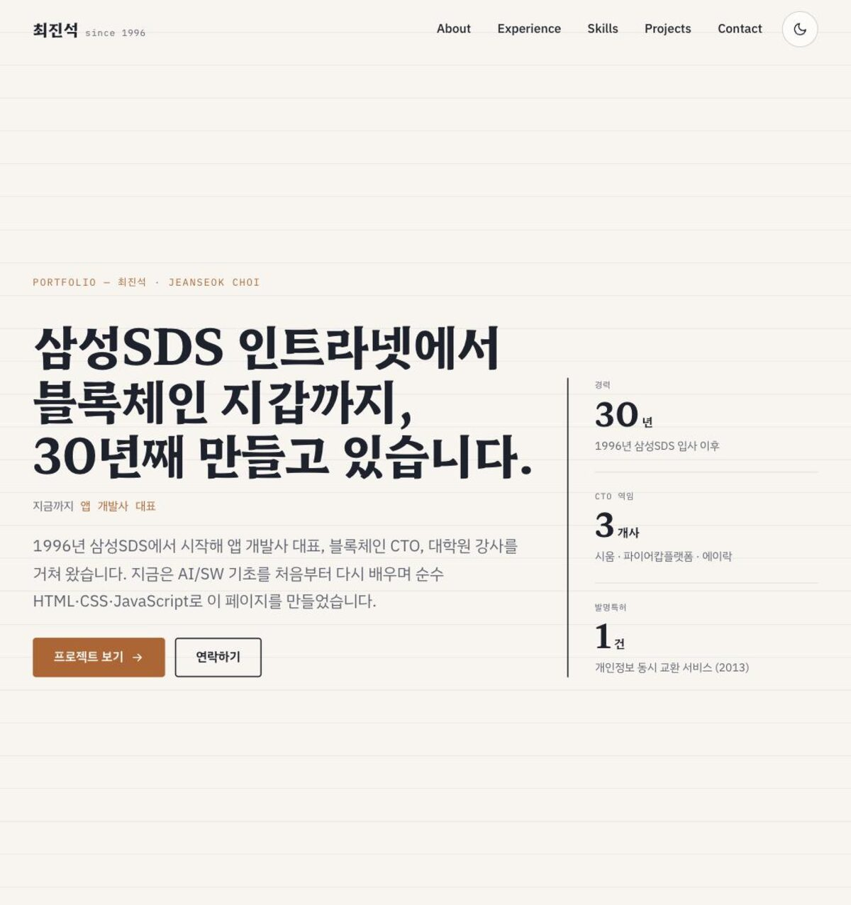
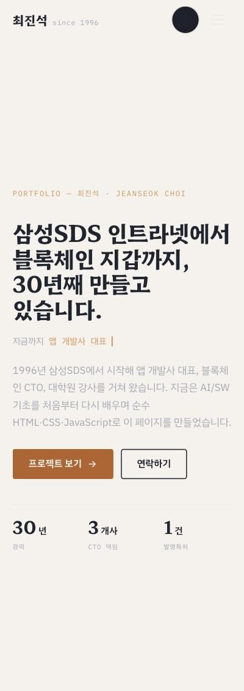
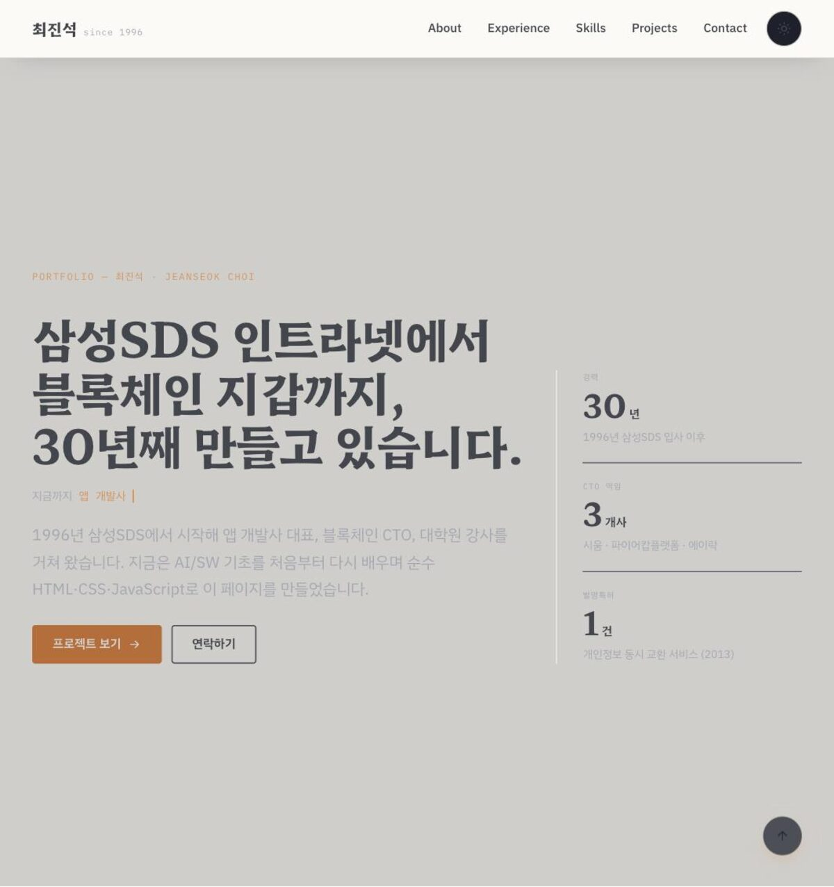
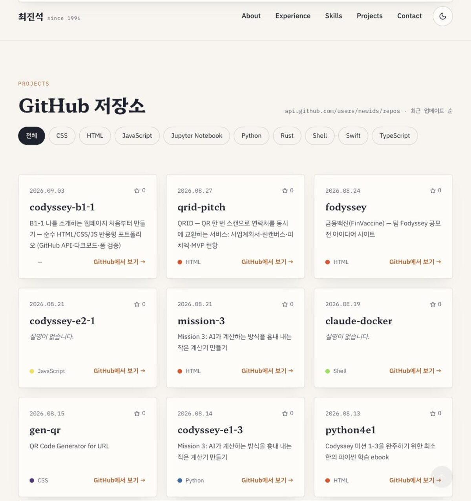

# 최진석 포트폴리오 — 나를 소개하는 웹페이지 처음부터 만들기

순수 HTML / CSS / JavaScript(ES6+)만으로 만든 반응형 개인 포트폴리오입니다.
React·Vue·jQuery·Bootstrap·Tailwind 같은 외부 라이브러리 없이, 시맨틱 마크업 · CSS 변수 · Flexbox/Grid ·
바닐라 JS DOM 조작 · GitHub REST API 연동을 직접 구현했습니다. (Codyssey B1-1 미션)

- **배포 URL**: https://newids.github.io/codyssey-b1-1/
- **저장소**: https://github.com/newids/codyssey-b1-1
- **디자인 캔버스(Claude Design)**: https://claude.ai/code/artifact/a96c9e55-c9b6-49f7-af60-e68cd0eea9ee
- **문서**: [미션 수행 가이드](docs/GUIDE.md) · [평가 설명서](docs/EVALUATION.md)

## 스크린샷

| 데스크톱 | 모바일 | 다크 모드 |
| --- | --- | --- |
|  |  |  |

| Projects — GitHub API 성공 상태 + 언어 필터 |
| --- |
|  |

> 배포 URL(https://newids.github.io/codyssey-b1-1/)에서 촬영. 2026-09-04.

## 사용 기술

| 영역 | 내용 |
| --- | --- |
| HTML5 | `header / nav / main / section / article / footer` 시맨틱 구조, `label for-id` 매칭, 모든 이미지 `alt` |
| CSS3 | `:root` 디자인 토큰(색·폰트·간격), `[data-theme="dark"]` 다크 테마 토큰, Flexbox 내비게이션, Grid(`auto-fit`, `minmax`) 프로젝트 카드, 모바일 퍼스트 반응형(768 / 1024), `clamp()` 유동 타이포, `prefers-reduced-motion` 대응 |
| JavaScript | `const`/`let`, 화살표 함수, 템플릿 리터럴, 구조분해 할당, `map / filter / forEach`, `fetch` + `async/await` + `try/catch`, `IntersectionObserver`, `localStorage`, `matchMedia` |
| 외부 리소스 | Google Fonts (Hahmlet · IBM Plex Sans KR · IBM Plex Mono) — 아이콘은 인라인 SVG |

## 폴더 구조

```
index.html          메인 페이지 (모든 섹션)
css/style.css       디자인 토큰 · 레이아웃 · 반응형 · 다크 테마
js/theme.js         다크 모드 토글 + localStorage 저장 + 시스템 설정 감지
js/nav.js           햄버거 메뉴 토글, 스크롤 시 내비게이션 배경 변경
js/scrollTop.js     맨 위로 버튼
js/reveal.js        IntersectionObserver 스크롤 애니메이션
js/typing.js        Hero 타이핑 효과 (보너스)
js/github.js        GitHub API 호출, 로딩/성공/에러/빈 상태 렌더링, 언어별 필터 (보너스)
js/contactForm.js   문의 폼 유효성 검사
images/profile.jpg  프로필 사진
docs/               미션 수행 가이드 · 평가 설명서
```

## 주요 기능과 기준값

| 기능 | 기준값 / 방식 | 구현 위치 |
| --- | --- | --- |
| 다크 모드 | 토글 → `data-theme` 속성 변경 → `localStorage('portfolio-theme')` 저장, 저장값이 없으면 `prefers-color-scheme` 따름 | `js/theme.js` |
| 햄버거 메뉴 | 768px 미만에서 표시, `classList.toggle('is-open')`, `aria-expanded` 동기화, Esc로 닫기 | `js/nav.js` |
| 내비게이션 배경 변경 | 스크롤 **60px** 이상에서 `.is-scrolled` 추가 | `js/nav.js` (`NAV_SCROLL_THRESHOLD`) |
| 맨 위로 버튼 | 스크롤 **300px** 이상에서 표시 | `js/scrollTop.js` (`SCROLL_TOP_THRESHOLD`) |
| 부드러운 스크롤 | CSS `scroll-behavior: smooth` + `scroll-padding-top` | `css/style.css` |
| 스크롤 애니메이션 | `IntersectionObserver` threshold **0.2**, 한 번 보이면 관찰 해제 | `js/reveal.js` |
| GitHub 프로젝트 | `https://api.github.com/users/newids/repos?per_page=100&sort=updated`, fork 제외, 최대 9개 표시 | `js/github.js` |
| API 상태 UI | `loading`(스피너 + 스켈레톤) · `success`(카드 grid) · `error`(메시지 + 재시도, 403 레이트리밋 안내) · `empty` | `js/github.js` `render()` |
| 언어 필터 (보너스) | 저장소 언어 목록을 `Set`으로 추출 → 필터 버튼 생성 → `array.filter()` | `js/github.js` |
| 문의 폼 | 필수값 · 이메일 정규식 검증, 필드 아래 에러 메시지, `preventDefault()` 후 성공 메시지 | `js/contactForm.js` |
| 타이핑 효과 (보너스) | Hero 역할 문구 타이핑/삭제 반복, `prefers-reduced-motion` 시 정적 표시 | `js/typing.js` |

## "이벤트 → 상태 변경 → 화면 업데이트" 흐름

1. **다크 모드**: 클릭 → `applyTheme(next)` → `data-theme` 변경 → CSS 변수 세트 교체로 전체 화면 스타일 변경
2. **GitHub API**: `loadRepos()` → `setState({status:'loading'})` → fetch 결과에 따라 `success` / `error` → `render()`가 상태별 마크업 출력
3. **폼 유효성**: `input` / `submit` → `setFormState({errors})` → `renderForm()`이 에러 메시지·`is-invalid` 클래스 표시/숨김
4. **언어 필터**: 필터 버튼 클릭 → `setState({filter})` → `getVisibleRepos()` 재계산 → 카드 목록 재렌더링

## 로컬 실행

1. 저장소를 클론합니다.
2. VS Code에서 열고 **Live Server** 확장으로 `index.html`을 엽니다. (또는 `python3 -m http.server 8080`)
3. 다른 GitHub 계정으로 바꾸려면 `js/github.js`의 `GITHUB_USERNAME`만 수정합니다.

> GitHub API는 인증 없이 **시간당 60회** 제한이 있습니다. 짧은 시간에 반복 새로고침하면 403이 나며,
> 이때 에러 상태 UI(재시도 버튼)가 표시됩니다.

## GitHub Pages 배포

1. GitHub에 저장소를 만들고 `main` 브랜치를 푸시합니다.
2. `Settings → Pages → Build and deployment`에서 Source를 **Deploy from a branch**, Branch를 `main` / `/ (root)`로 설정합니다.
3. 1~2분 뒤 `https://<계정>.github.io/<저장소>/` 에서 확인하고, 위 배포 URL을 채웁니다.
