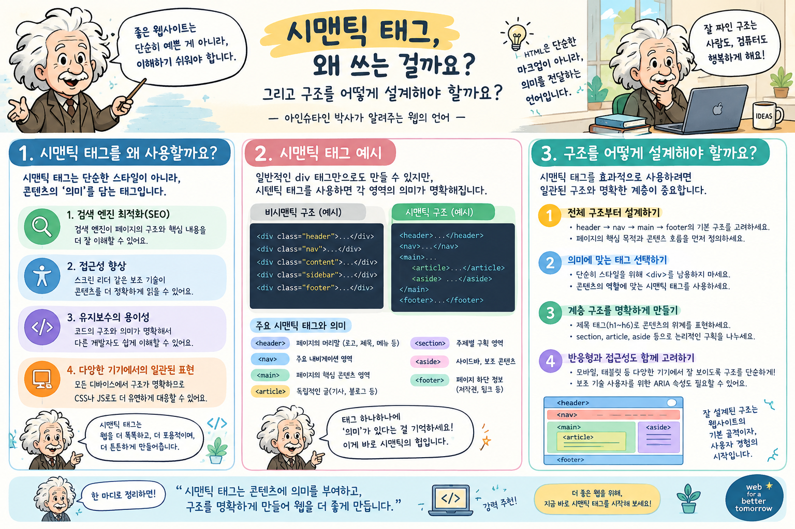
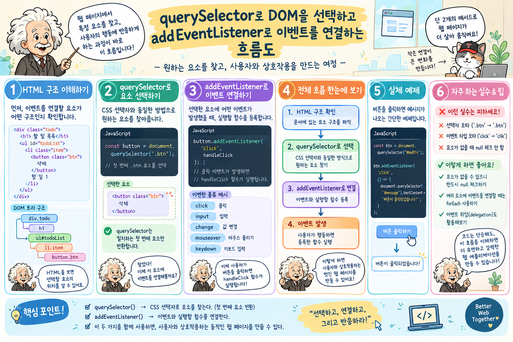
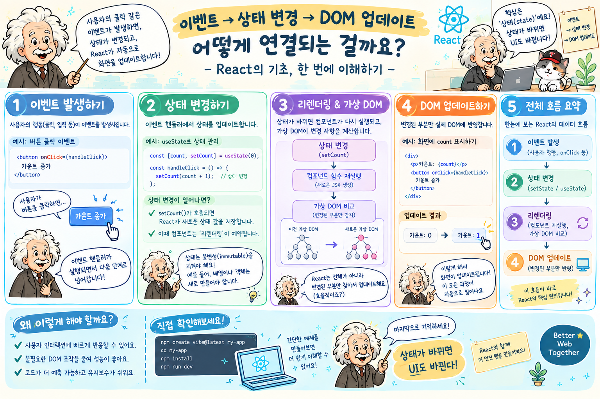

# 과제 목표 6개 — 초보 개발자용 5분 답변

[과제 목표 6개 상세 답변](OBJECTIVES.md)을 처음 배우는 개발자 눈높이에 맞춰 줄인 문서다. 질문 하나당 5분 안에 말로 설명할 수 있는 분량으로 맞췄다. 각 절은 한 줄 답변, 쉬운 설명, 이 프로젝트의 실제 코드 한 조각, 말로 설명할 때의 순서로 이루어진다. 코드 조각은 설명에 필요한 줄만 남기고 줄인 것이다. 원문과 행 번호, 대안 비교 같은 자세한 근거는 상세 답변 문서에 있다.

## 목차

1. [Q1. 시맨틱 태그는 왜 쓰고, 구조는 어떻게 나눴나](#q1-시맨틱-태그는-왜-쓰고-구조는-어떻게-나눴나)
2. [Q2. Flexbox와 Grid는 무엇이 다르고, 언제 무엇을 쓰나](#q2-flexbox와-grid는-무엇이-다르고-언제-무엇을-쓰나)
3. [Q3. querySelector로 요소를 찾고 addEventListener로 이벤트를 붙이는 순서](#q3-queryselector로-요소를-찾고-addeventlistener로-이벤트를-붙이는-순서)
4. [Q4. 화살표 함수·구조분해·배열 메서드는 왜 쓰나](#q4-화살표-함수구조분해배열-메서드는-왜-쓰나)
5. [Q5. fetch와 async/await로 데이터를 받고, 로딩·성공·실패 화면을 만드는 법](#q5-fetch와-asyncawait로-데이터를-받고-로딩성공실패-화면을-만드는-법)
6. [Q6. 이벤트 → 상태 변경 → 화면 갱신은 어떻게 이어지나 (React의 기초)](#q6-이벤트--상태-변경--화면-갱신은-어떻게-이어지나-react의-기초)
7. [정리: 여섯 답변을 한 문장씩](#정리-여섯-답변을-한-문장씩)

---

## Q1. 시맨틱 태그는 왜 쓰고, 구조는 어떻게 나눴나

### 한 줄 답변

HTML 태그에는 역할이 정해진 태그와 역할이 없는 태그가 있다. 역할이 정해진 태그(시맨틱 태그)를 쓰면 브라우저, 스크린리더, 검색엔진이 페이지의 어느 부분이 무엇인지 알 수 있다. 이 페이지는 `header / main / footer`로 크게 나누고, 주제마다 `section`과 제목을 하나씩 두었다.

### 쉽게 설명하면

- `div`는 아무 뜻이 없는 상자다. `header`, `nav`, `main`, `footer`는 이름 그대로 머리, 메뉴, 본문, 바닥이라는 뜻을 가진다. 화면에 보이는 모양은 같아도 뜻이 다르다.
- 스크린리더(화면을 읽어 주는 프로그램)를 쓰는 사람은 "본문으로 이동", "메뉴로 이동"처럼 영역 단위로 건너뛸 수 있다. 전부 `div`로 만들면 처음부터 끝까지 순서대로 들어야 한다.
- 검색엔진은 `main` 안을 본문으로, `nav`를 메뉴로 구분해서 읽는다.
- `button`, `a`, `label`은 키보드 조작이 기본으로 된다. Tab 키로 이동하고 Enter로 누를 수 있다. `div`에 클릭 이벤트를 붙여 버튼처럼 쓰면 이 동작을 전부 직접 만들어야 한다.

태그를 고를 때 쓴 기준은 다음과 같다.

| 이런 내용이면 | 이 태그 |
| --- | --- |
| 페이지에 하나뿐인 큰 영역 (머리, 본문, 바닥) | `header` / `main` / `footer` |
| 목차에 오를 만한 주제 하나 | `section` + 제목(`h2`) |
| 떼어내도 그 자체로 완결되는 카드 | `article` |
| 순서가 있는 목록 (경력 타임라인) | `ol` |
| 이름과 값의 쌍 (경력: 30년) | `dl` / `dt` / `dd` |
| 입력란 | `label` + `input` (`for`와 `id`로 연결) |

### 이 프로젝트에서는

`index.html`의 뼈대는 다음과 같다.

```html
<header>
  <nav aria-label="주요 내비게이션">…</nav>
</header>

<main id="main">
  <section id="about" aria-labelledby="aboutTitle">
    <h2 id="aboutTitle">문제를 코드로 풀어온 사람</h2>
    …
  </section>
  <!-- experience, skills, projects, contact 섹션도 같은 모양 -->
</main>

<footer>…</footer>
```

섹션마다 `h2` 제목이 하나 있고, `section`의 `aria-labelledby`가 그 제목을 가리킨다. 이렇게 하면 스크린리더의 영역 목록에 "About"이라는 이름으로 오른다. 경력은 최신순이라는 순서가 있으므로 `ol`, 기술 카드는 떼어내도 뜻이 남으므로 `article`, "경력 30년" 같은 이름과 값은 `dl`로 표시했다. 문의 폼의 입력란은 `label for="contactName"`과 `input id="contactName"`으로 묶어서, 라벨을 클릭하면 입력란에 커서가 간다.

### 5분 답변 순서

1. 시맨틱 태그는 "뜻이 있는 태그"다. `div`와 `header`는 모양은 같지만 뜻이 다르다.
2. 뜻이 있으면 스크린리더는 영역 단위로 건너뛰고, 검색엔진은 본문과 메뉴를 구분한다.
3. `button`과 `label`은 키보드 조작이 기본으로 된다. `div`로 흉내 내면 직접 만들어야 한다.
4. 이 페이지는 `header / main / footer` 세 덩어리, 그 안에 주제별 `section`과 `h2` 하나씩이다.
5. 순서가 있으면 `ol`, 완결된 카드면 `article`, 이름과 값이면 `dl`이라는 기준으로 골랐다.

### 인포그래픽



---

## Q2. Flexbox와 Grid는 무엇이 다르고, 언제 무엇을 쓰나

### 한 줄 답변

Flexbox는 항목을 한 줄(가로 또는 세로)로 늘어놓을 때 쓰고, Grid는 행과 열을 함께 맞춰야 할 때 쓴다. 이 페이지는 메뉴와 버튼 묶음에 Flexbox를, 카드 목록과 화면 분할에 Grid를 썼다.

### 쉽게 설명하면

- **Flexbox**는 한 방향으로 나열한다. 항목의 크기에 따라 배치가 정해진다. 메뉴, 버튼 두 개, 태그 목록처럼 "한 줄에 순서대로 놓기만 하면 되는" 곳에 쓴다.
- **Grid**는 먼저 칸(행과 열)을 정해 놓고 항목을 칸에 넣는다. 여러 줄이 되어도 위아래 열이 맞는다. 카드 목록, 왼쪽 8 : 오른쪽 4 같은 화면 분할에 쓴다.
- 고르는 기준은 한 문장이다. 줄만 바뀌면 되면 Flexbox, 줄과 열을 모두 맞춰야 하면 Grid.
- 반응형은 모바일 퍼스트로 만들었다. 좁은 화면 규칙을 기본으로 쓰고, 768px과 1024px 이상에서 규칙을 덧붙인다. 기본 상태가 가장 단순해서 문제를 찾기 쉽다.

### 이 프로젝트에서는

상단 메뉴는 Flexbox다. 로고는 왼쪽, 메뉴는 오른쪽에 붙이는 데 선언 세 줄이면 된다. (`css/style.css` `.navbar`)

```css
.navbar {
  display: flex;
  align-items: center;
  justify-content: space-between;
}
```

프로젝트 카드 목록은 Grid다. (`css/style.css` `.projects-grid`)

```css
.projects-grid {
  display: grid;
  grid-template-columns: repeat(auto-fit, minmax(min(100%, 280px), 1fr));
  gap: var(--space-5);
}
```

두 번째 줄은 "폭이 280px 이상인 열을 들어가는 만큼 만들고, 남는 공간은 똑같이 나눠라"는 뜻이다. 화면이 넓으면 3열, 좁으면 1열이 된다. 미디어 쿼리 없이 열 수가 바뀐다. 카드가 마지막 줄에 하나만 남아도 위 줄과 열이 맞는다. Flexbox로 카드를 늘어놓으면 마지막 줄의 카드가 혼자 커지거나 열이 어긋난다.

Hero 영역은 모바일에서 세로로 쌓기만 하면 되므로 Flexbox의 세로 방향(`flex-direction: column`)을 쓰고, 1024px 이상에서 `display: grid; grid-template-columns: 8fr 4fr`로 바꿔 왼쪽 8, 오른쪽 4로 나눴다. 같은 요소라도 화면 폭에 따라 도구를 바꿀 수 있다.

### 5분 답변 순서

1. Flexbox는 한 방향 나열, Grid는 행과 열을 함께 맞추는 격자다.
2. 줄만 바뀌면 되면 Flexbox, 줄과 열을 모두 맞춰야 하면 Grid.
3. 메뉴는 Flexbox 세 줄로 끝난다. `space-between`으로 양 끝에 붙인다.
4. 카드 목록은 Grid의 `auto-fit`과 `minmax`로 미디어 쿼리 없이 1열에서 3열까지 바뀐다.
5. 모바일 퍼스트로 만들고 768px과 1024px에서 규칙을 덧붙였다. Hero는 그 지점에서 Flexbox에서 Grid로 바뀐다.

### 인포그래픽


---

## Q3. querySelector로 요소를 찾고 addEventListener로 이벤트를 붙이는 순서

### 한 줄 답변

먼저 요소를 찾아 변수에 담고, 그 요소에 `addEventListener`로 "이런 일이 생기면 이 함수를 실행하라"고 등록한다. 스크립트는 `defer`를 붙여 HTML을 다 읽은 뒤에 실행되게 했다. HTML 안에는 `onclick` 속성을 하나도 쓰지 않았다.

### 쉽게 설명하면

세 단계다.

1. **찾기.** `document.getElementById('navToggle')`처럼 요소를 찾아 변수에 담는다. `id`가 있고 하나뿐이면 `getElementById`, 여러 개를 한 번에 잡으려면 `querySelectorAll`을 쓴다.
2. **등록.** `요소.addEventListener('click', 함수)`로 이벤트와 함수를 연결한다. 클릭, 스크롤, 키 입력, 폼 제출 모두 같은 방식이다.
3. **처리.** 함수 안에서 클래스를 켜고 끄거나(`classList.toggle`), 속성을 바꾼다(`setAttribute`).

주의할 점이 두 가지 있다.

- **실행 시점.** 스크립트를 `<head>`에 그냥 두면 HTML을 아직 다 읽지 않은 시점에 실행되어 요소를 찾아도 `null`이 나온다. `<script defer src="…">`로 연결하면 HTML 파싱이 끝난 뒤에 파일 순서대로 실행된다.
- **나중에 생기는 요소.** 언어 필터 버튼은 API 응답이 온 뒤에 만들어진다. 버튼마다 이벤트를 달면 다시 만들 때마다 다시 달아야 한다. 대신 처음부터 있는 부모 요소에 이벤트를 하나만 두고, 클릭된 것이 버튼인지 `closest()`로 확인한다. 이 방식을 이벤트 위임이라고 한다.

### 이 프로젝트에서는

햄버거 메뉴를 여닫는 코드다. (`js/nav.js`)

```js
// 1. 찾기
const navToggle = document.getElementById('navToggle');
const navMenu = document.getElementById('navMenu');
const navLinks = document.querySelectorAll('.nav-link');

// 3. 처리: 열림/닫힘 상태를 한 함수에서 반영
const setMenuOpen = (isOpen) => {
  navMenu.classList.toggle('is-open', isOpen);
  navToggle.setAttribute('aria-expanded', String(isOpen));
};

// 2. 등록
navToggle.addEventListener('click', () => {
  const isOpen = navMenu.classList.toggle('is-open');
  setMenuOpen(isOpen);
});

navLinks.forEach((link) => {
  link.addEventListener('click', () => setMenuOpen(false));
});
```

메뉴를 여는 곳은 버튼 하나지만 닫는 곳은 링크 다섯 개와 Esc 키까지 여럿이다. 모두 `setMenuOpen` 한 함수를 거치므로 클래스와 `aria-expanded`가 서로 어긋나지 않는다.

필터 버튼은 이벤트 위임으로 처리했다. (`js/github.js`)

```js
filterBar.addEventListener('click', ({ target }) => {
  const button = target.closest('[data-filter]');
  if (!button) return;
  setState({ filter: button.dataset.filter });
});
```

### 5분 답변 순서

1. 찾기, 등록, 처리 세 단계다.
2. 하나뿐인 요소는 `getElementById`, 여러 개는 `querySelectorAll`과 `forEach`.
3. 스크립트에 `defer`를 붙여야 HTML을 다 읽은 뒤 실행된다. 안 붙이면 `null`이 나온다.
4. 여닫기처럼 여러 곳에서 바꾸는 상태는 함수 하나(`setMenuOpen`)로 모은다.
5. 나중에 생기는 버튼은 부모에 이벤트 하나를 두고 `closest()`로 확인한다.

### 인포그래픽



---

## Q4. 화살표 함수·구조분해·배열 메서드는 왜 쓰나

### 한 줄 답변

화살표 함수는 짧은 함수를 짧게 쓰는 문법이고, 구조분해는 객체에서 필요한 값만 꺼내는 문법이며, `map / filter / forEach`는 `for` 반복문 대신 배열을 다루는 메서드다. 셋 다 코드를 짧고 읽기 쉽게 만든다. 배열 메서드는 원본 배열을 바꾸지 않는다.

### 쉽게 설명하면

**화살표 함수.** 아래 두 줄은 같은 일을 한다.

```js
function double(x) { return x * 2; }
const double = (x) => x * 2;
```

이벤트 처리기나 `map`에 넘기는 짧은 함수에 알맞다. `function`으로 만든 함수는 호출 방식에 따라 `this`가 달라져서 헷갈리지만, 화살표 함수는 `this`를 따로 만들지 않으므로 그 고민이 없다.

**구조분해.** 객체에서 값을 꺼내는 두 가지 방법이다.

```js
const name = repo.name;
const url = repo.html_url;

const { name, html_url: url } = repo;   // 위 두 줄과 같다
```

`html_url: url`은 "`html_url` 값을 꺼내서 `url`이라는 이름으로 쓰겠다"는 뜻이다.

**배열 메서드.** 세 가지의 차이는 결과가 무엇이냐다.

| 메서드 | 하는 일 | 결과 |
| --- | --- | --- |
| `map` | 각 항목을 다른 것으로 바꾼다 | 같은 길이의 새 배열 |
| `filter` | 조건에 맞는 항목만 남긴다 | 조건에 맞는 항목만 담은 새 배열 |
| `forEach` | 각 항목에 대해 어떤 일을 한다 | 없음 |

세 메서드 모두 원본 배열은 그대로 두고 새 배열을 만든다. 그래서 상태에 있는 배열을 가공해도 상태는 바뀌지 않는다.

### 이 프로젝트에서는

GitHub 저장소 객체를 카드 HTML로 바꾸는 함수다. (`js/github.js`)

```js
const createRepoCard = ({ name, description, html_url: url, language, stargazers_count: stars }) => {
  const languageLabel = language ?? '—';
  …
};

projectsGrid.innerHTML = shownRepos.map(createRepoCard).join('');
```

GitHub가 주는 저장소 객체에는 필드가 90개가 넘는다. 매개변수 자리에서 구조분해로 다섯 개만 꺼내니 이 함수가 무엇을 쓰는지 첫 줄에서 보인다. `map(createRepoCard)`는 저장소 배열을 HTML 문자열 배열로 바꾸고, `join('')`이 하나의 문자열로 합친다.

`filter`는 두 곳에서 쓴다. 다른 사람 저장소를 복제한 fork를 빼는 곳과, 선택한 언어의 저장소만 남기는 곳이다.

```js
const ownRepos = data.filter(({ fork }) => !fork);

const getVisibleRepos = () =>
  state.repos.filter(({ language }) => state.filter === FILTER_ALL || language === state.filter);
```

`state.repos`는 그대로 남으므로 필터를 "전체"로 되돌릴 수 있다. `forEach`는 링크 다섯 개에 이벤트를 등록하는 곳처럼 결과가 필요 없는 반복에 썼다.

### 5분 답변 순서

1. 화살표 함수는 `function`과 `return`을 줄인 문법이고, `this`를 따로 만들지 않아 콜백에 알맞다.
2. 구조분해는 객체에서 필요한 값만 한 줄로 꺼내는 문법이다. 이름도 바꿀 수 있다.
3. `map`은 변환, `filter`는 선별, `forEach`는 결과 없는 반복이다. 원본은 바뀌지 않는다.
4. 카드 생성 함수는 매개변수 구조분해로 필드 다섯 개만 받고, `map`과 `join`으로 HTML을 만든다.
5. `filter`로 fork를 빼고 언어별로 고른다. 원본 배열이 남아 있어서 필터를 되돌릴 수 있다.

### 인포그래픽


---

## Q5. fetch와 async/await로 데이터를 받고, 로딩·성공·실패 화면을 만드는 법

### 한 줄 답변

데이터를 요청하기 전에 화면을 먼저 "로딩 중"으로 바꾼다. `await fetch()`로 응답을 기다린 뒤, 성공이면 카드를 그리고 실패면 원인 문구와 재시도 버튼을 보여 준다. 지금 어떤 화면인지는 `status` 값 하나(`loading / success / error`)로 정한다.

### 쉽게 설명하면

- `fetch()`는 서버에 요청을 보내는 함수다. 응답이 오기까지 시간이 걸린다. `await`를 붙이면 "응답이 올 때까지 이 함수만 기다린다"는 뜻이 된다. 페이지 전체가 멈추지는 않으므로 그동안 스피너가 돌고 다른 버튼도 눌린다. `await`는 `async`가 붙은 함수 안에서만 쓸 수 있다.
- `fetch`는 서버가 404나 403을 보내도 "응답은 왔다"고 보고 성공으로 처리한다. 그래서 `response.ok`를 확인해서 거짓이면 직접 오류를 던져야 한다.
- `try / catch`는 "`try` 안에서 문제가 생기면 `catch`로 넘어온다"는 구조다. 인터넷이 끊긴 경우와 서버가 오류를 보낸 경우가 모두 `catch`에 모인다.
- 화면 상태는 `loading`, `success`, `error` 세 가지다. 데이터는 왔는데 0건인 경우는 `success` 안에서 빈 화면으로 분기한다. 상태값이 하나이므로 "로딩 중인데 오류 문구도 보이는" 화면이 나올 수 없다.
- GitHub API는 로그인 없이 시간당 60회까지만 호출할 수 있다. 넘으면 403이 온다. 이때는 "잠시 후 다시 시도"라고 안내해야 사용자가 원인을 안다.

### 이 프로젝트에서는

데이터를 받는 함수 전체다. (`js/github.js`)

```js
async function loadRepos() {
  setState({ status: 'loading', errorMessage: '' });      // 1. 로딩 화면 먼저

  try {
    const response = await fetch(GITHUB_API_URL);         // 2. 응답을 기다린다
    if (!response.ok) {
      throw new Error(describeHttpError(response.status)); // 3. 403, 404는 직접 오류로
    }
    const data = await response.json();
    const ownRepos = data.filter(({ fork }) => !fork);
    setState({ status: 'success', repos: ownRepos });      // 4. 성공 화면
  } catch (error) {
    const isNetworkError = error instanceof TypeError;
    const errorMessage = isNetworkError ? '네트워크에 연결할 수 없습니다.' : error.message;
    setState({ status: 'error', errorMessage });           // 5. 실패 화면
  }
}
```

화면을 그리는 함수는 `status` 값만 보고 갈라진다.

```js
function render() {
  if (state.status === 'loading') renderLoading();      // 스피너 + 스켈레톤 카드
  else if (state.status === 'error') renderError();     // 원인 문구 + 재시도 버튼
  else if (state.status === 'success') renderSuccess(); // 카드 (0건이면 빈 화면)
}
```

재시도 버튼은 `loadRepos`를 다시 부를 뿐이다. 그러면 로딩부터 같은 길을 다시 간다.

### 5분 답변 순서

1. 요청을 보내기 전에 상태를 `loading`으로 바꿔 스피너를 먼저 보여 준다.
2. `await fetch()`로 기다린다. 이 함수만 멈추고 페이지는 계속 움직인다.
3. `response.ok`가 거짓이면 직접 오류를 던진다. `fetch`는 404도 성공으로 보기 때문이다.
4. `catch`에서 인터넷 끊김(`TypeError`)과 서버 오류를 구분해 다른 문구를 만든다.
5. `render()`는 `status` 하나만 보고 로딩, 성공, 실패 화면 중 하나를 그린다. 재시도는 같은 함수를 다시 부른다.

### 인포그래픽


---

## Q6. 이벤트 → 상태 변경 → 화면 갱신은 어떻게 이어지나 (React의 기초)

### 한 줄 답변

이벤트가 생기면 화면을 직접 고치지 않고 상태(변수)만 바꾼다. 상태를 바꾸는 함수가 곧바로 렌더 함수를 부르고, 렌더 함수는 상태를 보고 화면을 새로 그린다. React의 `useState`는 이 구조를 라이브러리가 대신 해 주는 것이다.

### 쉽게 설명하면

두 가지 방법을 비교하면 이해가 쉽다.

- **직접 고치는 방법.** 버튼을 클릭하면 그 자리에서 `innerHTML`을 바꾼다. 처음 로드, 필터 클릭, 재시도 세 곳에서 각각 화면을 고치게 되고, 한 곳을 수정하면 나머지가 어긋난다.
- **상태를 거치는 방법.** 클릭 → `setState({ filter: 'HTML' })` → `render()` → 화면. 화면을 고치는 코드는 `render()` 한 곳뿐이다. "지금 화면이 왜 이렇게 보이는가"의 답은 항상 "상태가 이렇기 때문"이다.

여기에 두 가지 원칙이 더 붙는다.

- 같은 정보는 한 곳에만 둔다. 저장소 목록은 `state.repos`에만 있다.
- 계산할 수 있는 값은 저장하지 않는다. "필터에 맞는 저장소 목록"은 저장하지 않고 그릴 때마다 `filter`로 계산한다. 그래야 원본이나 필터가 바뀌어도 항상 최신이다.

React와 대응시키면 다음과 같다.

| 이 프로젝트 | React |
| --- | --- |
| `const state = { status, repos, filter }` | `const [filter, setFilter] = useState('all')` |
| `setState(patch)` 뒤에 `render()` 호출 | `setFilter(next)` 호출하면 자동으로 다시 그림 |
| `function render() { … innerHTML = … }` | 컴포넌트 함수 `function Projects() { return <…/> }` |
| `getVisibleRepos()`로 매번 계산 | 컴포넌트 안에서 `repos.filter(...)` |

React가 추가로 하는 일은 하나다. 통째로 다시 그리는 대신 이전 결과와 비교해서 바뀐 부분만 DOM에 반영한다. 구조 자체는 이 프로젝트와 같다.

### 이 프로젝트에서는

언어 필터 흐름이다. (`js/github.js`)

```js
// 상태: 정보는 여기 한 곳에만
const state = { status: 'idle', repos: [], filter: FILTER_ALL, errorMessage: '' };

// 상태를 바꾸는 유일한 함수. 바꾼 뒤 반드시 다시 그린다
const setState = (patch) => {
  Object.assign(state, patch);
  render();
};

// 이벤트: 화면을 건드리지 않고 상태만 바꾼다
filterBar.addEventListener('click', ({ target }) => {
  const button = target.closest('[data-filter]');
  if (!button) return;
  setState({ filter: button.dataset.filter });
});

// 렌더: 인수 없이 state만 읽어서 그린다
function render() {
  renderFilters();
  if (state.status === 'success') renderSuccess();
  …
}
```

클릭 처리기는 `setState` 한 줄이다. 활성 버튼 표시, 카드 목록, 개수 문구는 모두 `render()`가 상태를 보고 다시 만든다. 다크 모드도 같은 구조다. 클릭하면 `html` 요소의 `data-theme` 속성만 바꾸고, 색은 CSS가 그 속성을 보고 바꾼다.

### 5분 답변 순서

1. 이벤트는 화면을 고치지 않고 상태만 바꾼다.
2. 상태를 바꾸는 함수(`setState`)가 끝에서 반드시 `render()`를 부른다.
3. `render()`는 인수 없이 상태만 읽고 화면을 새로 그린다. 화면을 고치는 코드는 이 한 곳이다.
4. 같은 정보는 한 곳에만 두고, 계산할 수 있는 값은 저장하지 않는다.
5. React의 `useState` setter는 `setState`와 `render()`를 합친 것이고, 컴포넌트 함수는 `render()`다. React는 여기에 "바뀐 부분만 반영"을 더한 것이다.

### 인포그래픽



---

## 정리: 여섯 답변을 한 문장씩

1. **시맨틱 태그**: 뜻이 있는 태그를 쓰면 스크린리더와 검색엔진이 페이지 구조를 읽을 수 있다.
2. **Flexbox와 Grid**: 한 줄 나열은 Flexbox, 행과 열을 함께 맞추면 Grid.
3. **DOM 선택과 이벤트**: 찾기, 등록, 처리 세 단계. 스크립트는 `defer`로 HTML 뒤에 실행한다.
4. **ES6 문법**: 화살표 함수, 구조분해, `map / filter / forEach`는 코드를 짧고 읽기 쉽게 만들고 원본을 바꾸지 않는다.
5. **fetch와 상태 화면**: 로딩을 먼저 보여 주고, `await`로 기다리고, `ok`를 확인하고, 성공과 실패 화면을 `status` 하나로 정한다.
6. **이벤트 → 상태 → 화면**: 이벤트는 상태만 바꾸고, 렌더 함수가 상태를 보고 그린다. React는 이 구조를 자동화한 것이다.
